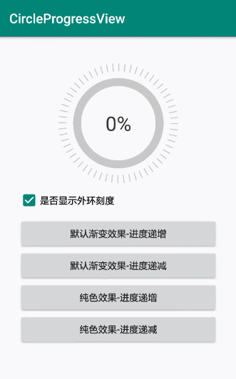

# CircleProgressView

[](https://raw.githubusercontent.com/jenly1314/CircleProgressView/master/app/release/app-release.apk)
[](https://bintray.com/beta/#/jenly/maven/circleprogressview)
[](https://jitpack.io/#jenly1314/CircleProgressView)
[](https://travis-ci.org/jenly1314/CircleProgressView)
[](https://circleci.com/gh/jenly1314/CircleProgressView)
[](https://android-arsenal.com/api?level=16)
[](https://opensource.org/licenses/mit-license.php)
[](https://jenly1314.github.io/)
[](http://shang.qq.com/wpa/qunwpa?idkey=8fcc6a2f88552ea44b1411582c94fd124f7bb3ec227e2a400dbbfaad3dc2f5ad)

CircleProgressView for Android 是一个圆形的进度动画控件，动画效果纵享丝滑。

> **CircleProgressView**不能满足你的需求？

 也许你想要的是[ArcSeekBar](https://github.com/jenly1314/ArcSeekBar)

## Gif 展示



## CircleProgressView自定义属性说明（进度默认渐变色）
| 属性 | 值类型 | 默认值 | 说明 |
| :------| :------ | :------ | :------ |
| cpvStrokeWidth | dimension |12dp| 笔画描边的宽度 |
| cpvNormalColor | color |<font color=#C8C8C8>#FFC8C8C8</font>| 圆正常颜色 |
| cpvProgressColor | color |<font color=#4FEAAC>#FF4FEAAC</font>| 圆进度颜色 |
| cpvStartAngle | integer | 270 | 开始角度，默认十二点钟方向 |
| cpvSweepAngle | integer | 360 | 扫描角度范围 |
| cpvMax | integer | 100 | 进度最大值 |
| cpvProgress | integer | 0 | 当前进度 |
| cpvDuration | integer | 500 | 动画时长 |
| cpvLabelText | string |  | 中间的标签文本，默认自动显示百分比 |
| cpvLabelTextColor | color |<font color=#333333>#FF333333</font>| 文本字体颜色 |
| cpvLabelTextSize | dimension |30sp| 文本字体大小 |
| cpvShowLabel | boolean | true | 是否显示文本 |
| cpvShowTick | boolean | true | 是否显示外环刻度 |
| cpvCirclePadding | dimension | 10dp | 外圆环刻度与内圆环间距 |
| cpvTickSplitAngle | integer | 5 | 刻度间隔的角度大小 |
| cpvBlockAngle | integer | 1 | 刻度的角度大小 |
| cpvTurn | boolean | false | 是否旋转 |


## 引入

### Maven：
```maven
<dependency>
  <groupId>com.king.view</groupId>
  <artifactId>circleprogressview</artifactId>
  <version>1.1.0</version>
  <type>pom</type>
</dependency>
```
### Gradle:
```gradle
implementation 'com.king.view:circleprogressview:1.1.0'
```

### Lvy:
```lvy
<dependency org='com.king.view' name='circleprogressview' rev='1.1.0'>
  <artifact name='$AID' ext='pom'></artifact>
</dependency>
```

###### 如果Gradle出现compile失败的情况，可以在Project的build.gradle里面添加如下：（也可以使用上面的GitPack来complie）
```gradle
allprojects {
    repositories {
        maven { url 'https://dl.bintray.com/jenly/maven' }
    }
}
```

## 示例

布局示例
```Xml
    <com.king.view.circleprogressview.CircleProgressView
        android:id="@+id/cpv"
        android:layout_width="wrap_content"
        android:layout_height="wrap_content"/>
```

代码示例
```Java
    //显示进度动画，进度，动画时长
    circleProgressView.showAnimation(80,3000);
    //设置当前进度
    circleProgressView.setProgress(80);

```

更多使用详情，请查看[app](app)中的源码使用示例

## 版本记录

#### v1.1.0：2019-8-19
*  移除appcompat依赖，适配AndroidX

#### v1.0.1：2019-5-23
*  新增cpvTurn属性（是否旋转）

#### v1.0.0：2019-2-17
*  CircleProgressView初始版本

## 赞赏
如果您喜欢CircleProgressView，或感觉CircleProgressView帮助到了您，可以点右上角“Star”支持一下，您的支持就是我的动力，谢谢 :smiley:<p>
您也可以扫描下面的二维码，请作者喝杯咖啡 :coffee:
    <div>
        
        
        
        
    </div>

## 关于我
   Name: <a title="关于作者" href="https://about.me/jenly1314" target="_blank">Jenly</a>

   Email: <a title="欢迎邮件与我交流" href="mailto:jenly1314@gmail.com" target="_blank">jenly1314#gmail.com</a> / <a title="给我发邮件" href="mailto:jenly1314@vip.qq.com" target="_blank">jenly1314#vip.qq.com</a>

   CSDN: <a title="CSDN博客" href="http://blog.csdn.net/jenly121" target="_blank">jenly121</a>

   CNBlogs: <a title="博客园" href="https://www.cnblogs.com/jenly" target="_blank">jenly</a>

   Github: <a title="Github开源项目" href="https://github.com/jenly1314" target="_blank">jenly1314</a>

   加入QQ群: <a title="点击加入QQ群" href="http://shang.qq.com/wpa/qunwpa?idkey=8fcc6a2f88552ea44b1411582c94fd124f7bb3ec227e2a400dbbfaad3dc2f5ad" target="_blank">20867961</a>
   <div>
       
       
   </div>

